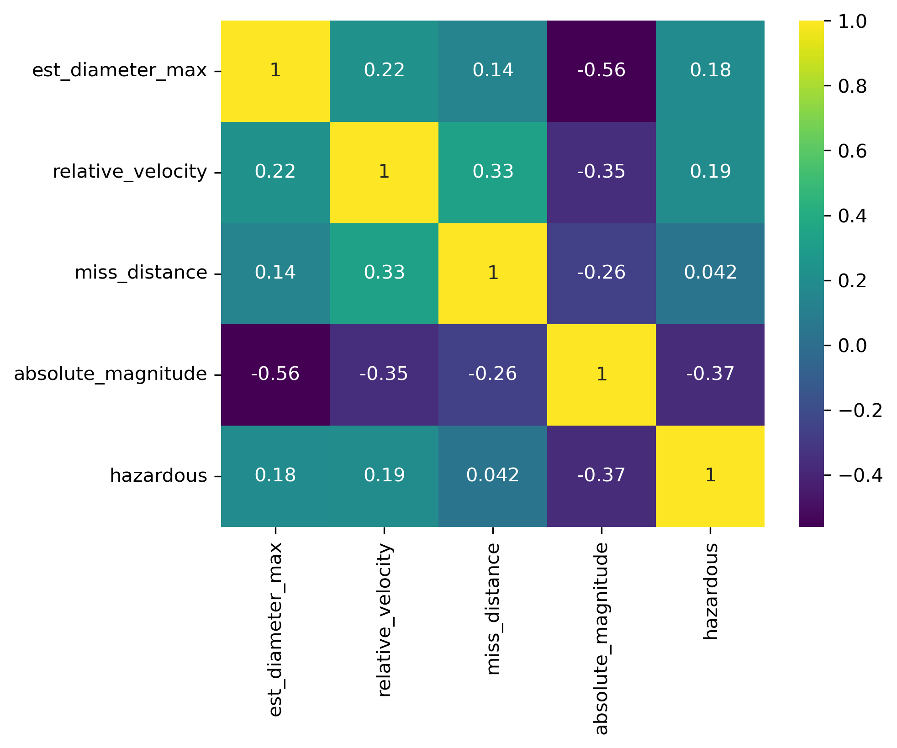
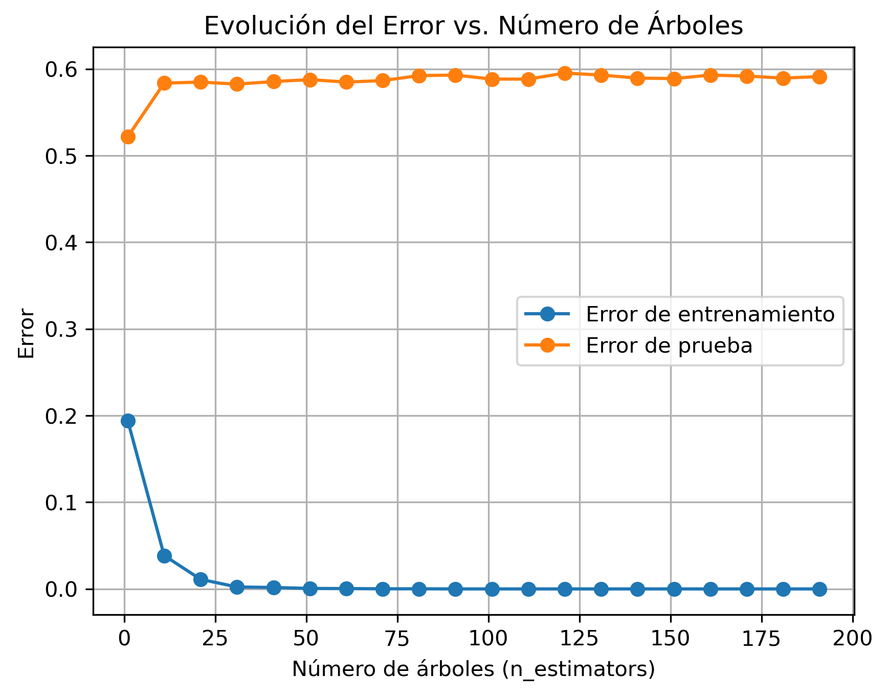
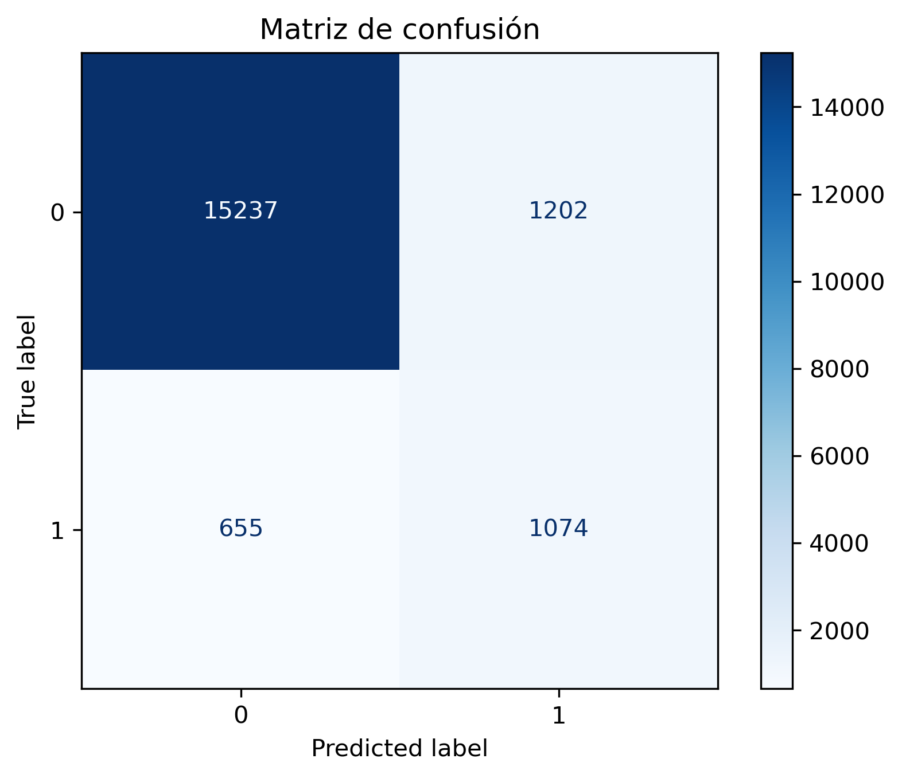
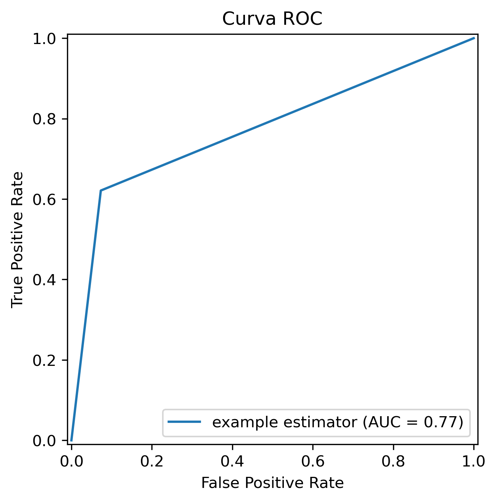

# **Clasificación de Objetos Cercanos a la Tierra con Bosques Aleatorios**

### **Descripción del Proyecto**
Este proyecto utiliza datos astronómicos para clasificar objetos cercanos a la Tierra (NEOs, por sus siglas en inglés) y predecir si son potencialmente peligrosos para el planeta. El análisis y modelado se realizan empleando técnicas avanzadas de Machine Learning con un enfoque en el diseño orientado a objetos (OOP).

El núcleo del proyecto está en la implementación modular de clases que encapsulan las tareas principales del pipeline de clasificación, desde el preprocesamiento de datos hasta la evaluación de modelos.

---

### **Características Clave**
1. **Clases Modulares**:
   - **BosqueAleatorioError**: Evalúa el error en función del número de árboles del modelo Random Forest.
   - **BosqueAleatorioClasificador**: Implementa un clasificador Random Forest con optimización de hiperparámetros mediante GridSearchCV.
   - **Correlacion**: Calcula y visualiza la matriz de correlación para entender relaciones entre variables.
   - **Evaluacion**: Proporciona herramientas para analizar el rendimiento del modelo, incluyendo reportes de clasificación, matriz de confusión y curva ROC.

2. **Optimización y Evaluación**:
   - Uso de validación cruzada para garantizar un rendimiento robusto del modelo.
   - Métricas clave como recall, precisión y AUC-ROC para evaluar modelos en contextos desbalanceados.

3. **Visualización**:
   - Mapas de calor para la matriz de correlación.
   - Curva ROC y matriz de confusión para la evaluación del modelo.
   - Gráficos de error vs. número de árboles en Random Forest.

---

### **Tecnologías Utilizadas**
- **Python**: Lenguaje principal del proyecto.
- **Scikit-learn**: Algoritmos de aprendizaje automático y herramientas de evaluación.
- **Matplotlib y Seaborn**: Visualización de datos y resultados.
- **Pandas y NumPy**: Procesamiento y manipulación de datos.

---

### **Estructura del Proyecto**
```plaintext
project/
│
├── src/                          # Código fuente organizado en módulos
│   ├── core/                     # Clases y utilidades
│   │   ├── modelos/              # Modelos y clasificación
│   │   │   ├── error_rf.py       # Clase BosqueAleatorioError
│   │   │   └── modelo_rf.py      # Clase BosqueAleatorioClasificador
│   │   ├── estadistica.py        # Clase Correlacion
│   │   └── evaluacion.py         # Clase Evaluacion
├── datos/                        # Datos originales y procesados
│   ├── neo_v2.csv                # Datos astronómicos originales
│   └── cleaned_data.csv          # Datos limpios y estandarizados
├── imagenes/                     # Visualizaciones generadas
│   ├── 1_correlacion.png         # Matriz de correlación
│   ├── 2_error.png               # Error vs. número de árboles
│   ├── 3_confusion.png           # Matriz de confusión
│   └── 4_roc.png                 # Curva ROC
└── README.md                     # Documentación del proyecto
```

---

### **Cómo Empezar**
#### **1. Requisitos Previos**
Asegúrate de tener instalados los siguientes componentes:
- Python 3.8 o superior.
- Librerías necesarias: `scikit-learn`, `numpy`, `pandas`, `matplotlib`, `seaborn`.

Instala las dependencias con:
```bash
pip install -r requirements.txt
```

#### **2. Ejecución del Proyecto**
1. **Preprocesamiento y análisis exploratorio**:
   - Limpieza y estandarización de datos.
   - Análisis de correlación y balance de clases.
2. **Modelado**:
   - Definición y entrenamiento del modelo Random Forest.
   - Optimización de hiperparámetros con GridSearchCV.
3. **Evaluación**:
   - Generación de reportes de clasificación.
   - Visualización de métricas clave.

---

### **Visualizaciones Generadas**
#### **Matriz de Correlación**:


#### **Error vs. Número de Árboles**:


#### **Matriz de Confusión**:


#### **Curva ROC**:


---

### **Métricas de Rendimiento**
- **Recall y Precisión**: Evaluación de modelos en contextos desbalanceados.
- **AUC-ROC**: Evaluación de la calidad de la clasificación.
